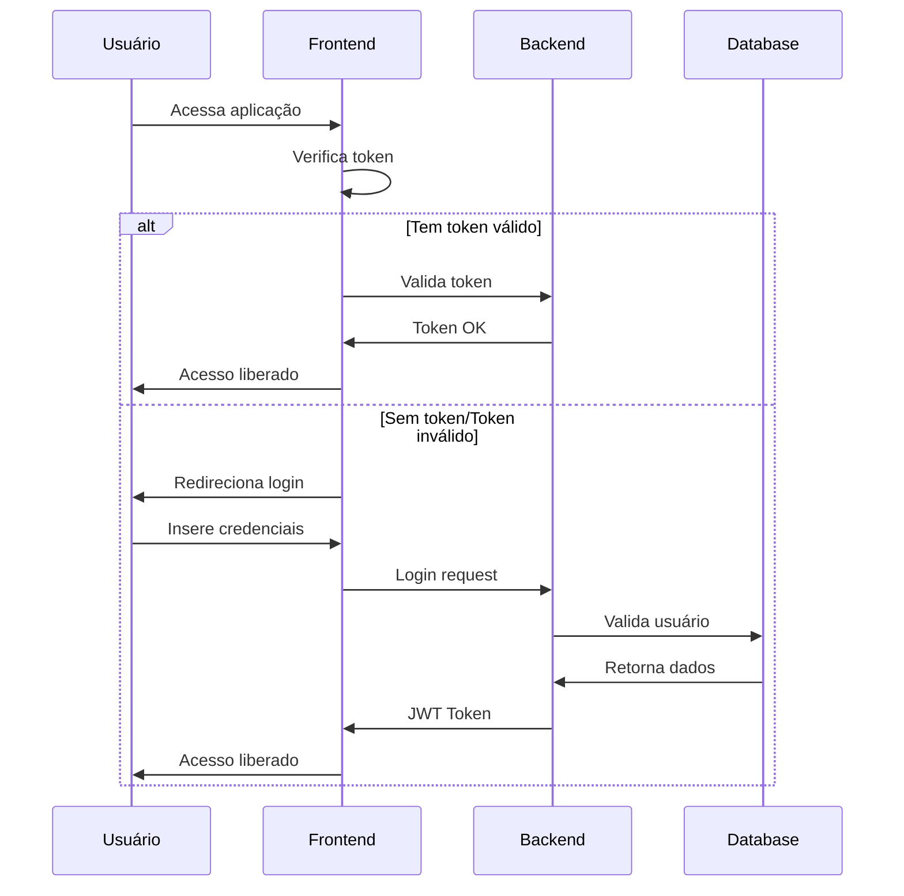
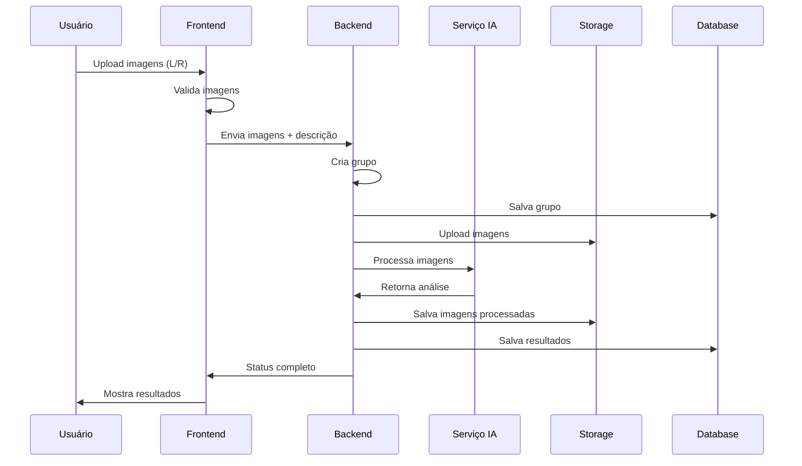
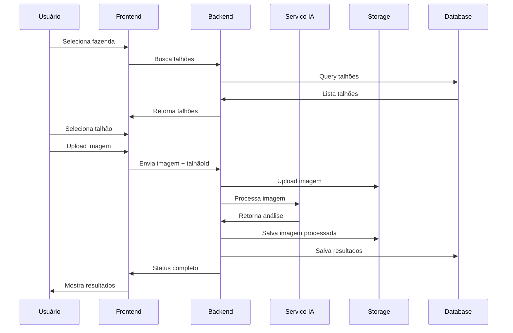
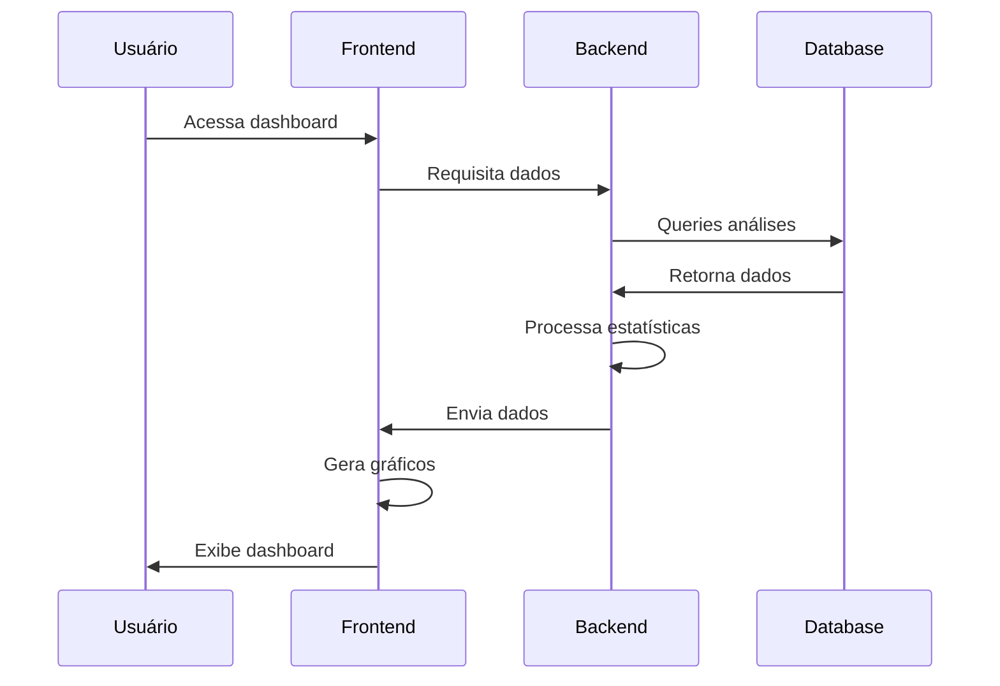
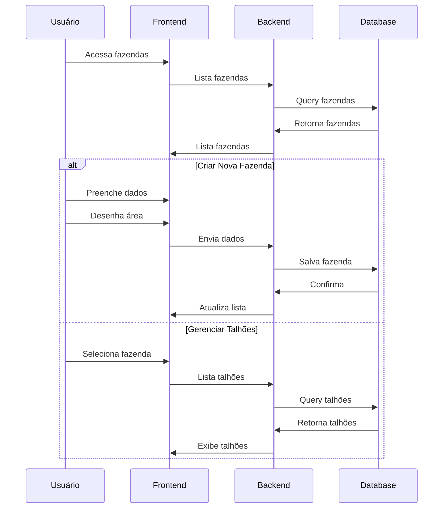
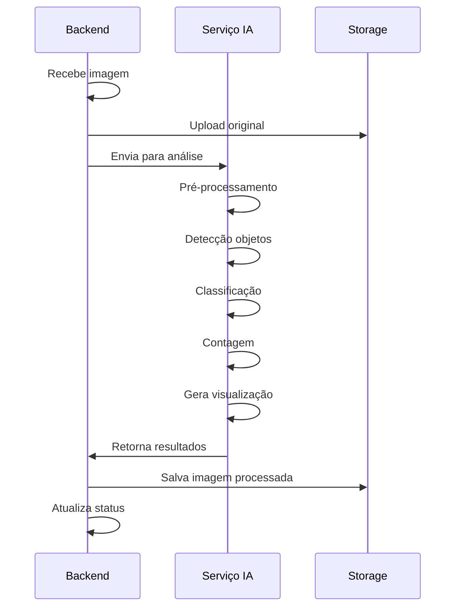
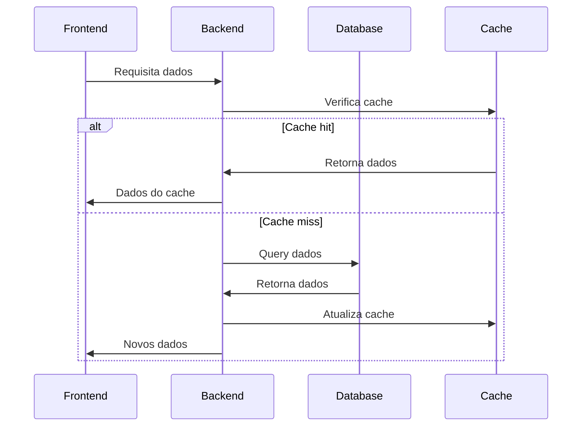
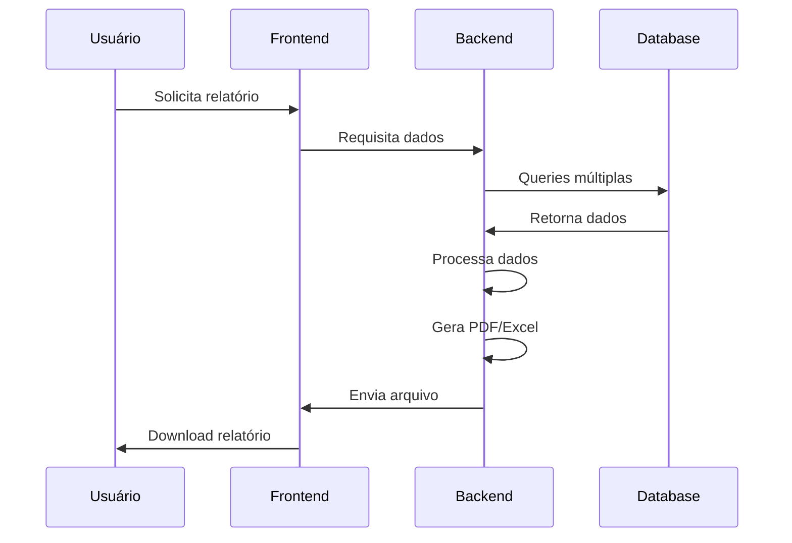

# Fluxo Detalhado da Aplicação Futuro Café

## 1. Fluxo de Autenticação

## 2. Fluxo de Análise Rápida

## 3. Fluxo de Análise por Talhão

## 4. Fluxo de Visualização de Dados

## 5. Fluxo de Gestão de Fazendas

## 6. Fluxo de Processamento de Imagens

## 7. Fluxo de Integração de Dados

## 8. Fluxo de Exportação de Relatórios

