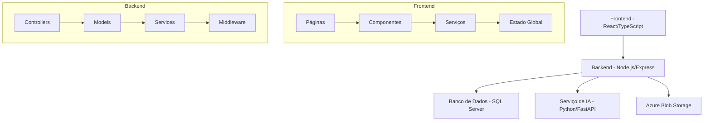

# Futuro Café

Sistema de análise e monitoramento de lavouras de café utilizando visão computacional e inteligência artificial.

## 🌟 Visão Geral

O Futuro Café é uma solução inovadora que permite aos produtores de café monitorar e analisar suas lavouras através de imagens, utilizando inteligência artificial para identificar diferentes estágios de maturação dos grãos.

## 🏗️ Arquitetura do Sistema



## 🔄 Fluxo Principal da Aplicação

1. **Autenticação e Autorização**
   - Login via JWT
   - Gerenciamento de sessão
   - Controle de acesso baseado em perfis

2. **Gestão de Fazendas**
   - Cadastro de fazendas
   - Gerenciamento de talhões
   - Mapeamento geográfico

3. **Análise de Imagens**
   - Upload de fotos dos grãos
   - Processamento via IA
   - Classificação dos grãos
   - Armazenamento dos resultados

4. **Análise Rápida**
   - Comparação entre amostras
   - Análise sem vínculo com talhão
   - Resultados instantâneos

5. **Visualização de Dados**
   - Gráficos de evolução
   - Estatísticas por talhão
   - Histórico de análises

## 🛠️ Stack Tecnológica

### Frontend
- React
- TypeScript
- Material-UI
- Styled Components
- React Query
- Axios

### Backend
- Node.js
- Express
- TypeScript
- Sequelize ORM
- JWT Authentication

### Banco de Dados
- SQL Server
- Azure Blob Storage (imagens)

### Serviço de IA
- Python
- FastAPI
- TensorFlow/PyTorch

## 📦 Estrutura do Projeto

```
futuro-cafe/
├── fc-web-fe/               # Frontend
│   ├── src/
│   │   ├── components/      # Componentes React
│   │   ├── pages/          # Páginas da aplicação
│   │   ├── services/       # Serviços e API
│   │   └── styles/         # Estilos globais
│   └── package.json
│
├── fc-web-be/               # Backend
│   ├── src/
│   │   ├── controllers/    # Controladores
│   │   ├── models/        # Modelos do banco
│   │   ├── services/      # Serviços
│   │   └── middleware/    # Middlewares
│   └── package.json
│
└── docker-compose.yml       # Configuração Docker
```

## 🚀 Como Executar

1. **Pré-requisitos**
   ```bash
   # Instalar dependências do frontend
   cd fc-web-fe
   npm install

   # Instalar dependências do backend
   cd fc-web-be
   npm install
   ```

2. **Configuração do Ambiente**
   - Criar arquivo `.env` no backend com as variáveis necessárias
   - Configurar conexão com SQL Server
   - Configurar Azure Blob Storage
   - Configurar endpoint do serviço de IA

3. **Executar com Docker**
   ```bash
   docker-compose up
   ```

4. **Executar em Desenvolvimento**
   ```bash
   # Frontend (Terminal 1)
   cd fc-web-fe
   npm run dev

   # Backend (Terminal 2)
   cd fc-web-be
   npm run dev
   ```

## 🔑 Variáveis de Ambiente

```env
# Backend
DB_HOST=localhost
DB_PORT=1433
DB_NAME=futurocafe
DB_USER=seu_usuario
DB_PASS=sua_senha
JWT_SECRET=seu_jwt_secret
AZURE_STORAGE_CONNECTION_STRING=sua_connection_string
PREDICTION_REQUEST_URL=url_servico_ia

# Frontend
VITE_API_URL=http://localhost:3000
```

## 📊 Modelos de Dados

### Fazenda
- Id (UUID)
- Nome (String)
- Localização (Geography)
- Área (Decimal)

### Talhão
- Id (UUID)
- FazendaId (UUID)
- Nome (String)
- Área (Decimal)
- Desenho (Geography)

### Análise
- Id (UUID)
- TalhãoId (UUID)
- Data (DateTime)
- Imagem (URL)
- Resultados (JSON)
- Coordenadas (Geography)

## 🤝 Contribuição

1. Faça o fork do projeto
2. Crie uma branch para sua feature (`git checkout -b feature/AmazingFeature`)
3. Commit suas mudanças (`git commit -m 'Add: nova feature'`)
4. Push para a branch (`git push origin feature/AmazingFeature`)
5. Abra um Pull Request

## 📝 Licença

Este projeto está sob a licença MIT. Veja o arquivo [LICENSE](LICENSE) para mais detalhes.

## 👥 Autores

- Equipe Futuro Café

## 📞 Suporte

Para suporte, envie um email para suporte@futurocafe.com.br 